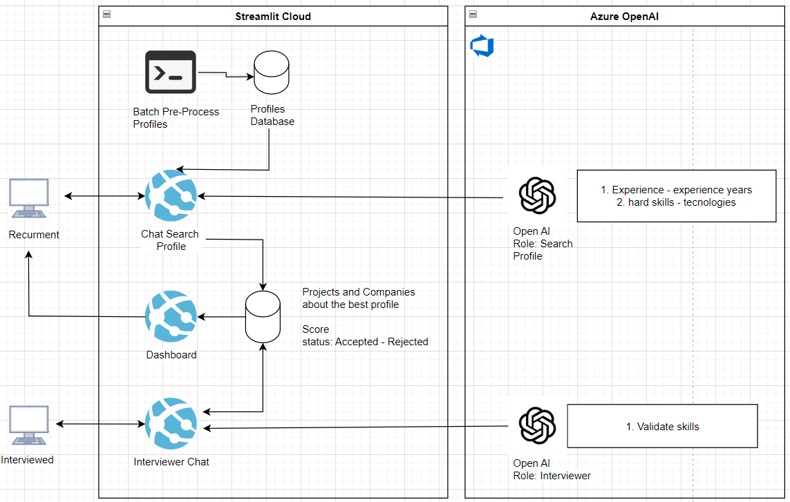

# 🧐 Description

AI chat that searches for the best candidates on the Endava profiles site the candidates and tries to identify profiles according to a job posting requirement.
Also, the interviewer's assistant can interview the candidate and evaluate him based on technical aspects as well as company values. 
At the end of the interview, the interviewer's assistant shows the strengths and weaknesses of every candidate. Also, the chat includes options for transforming results from text to speech.
At the end, you can see a dashboard with insights from every candidate.

# 💻 Architecture


## 🛠️ Installation

Use the package manager [pip](https://pip.pypa.io/en/stable/) to install the next libraries.

```bash
pip install openai
pip install streamlit
pip install python-dotenv
pip install PyPDF2
pip install st-pages
pip install chromadb
```

Also, you should create a .env file with the next keys on the root folder 
```python
OPENAI_API_KEY=<ADD THE API KEY>   # Ensure you use the correct API key
AZURE_ENDPOINT=https://aihackathoneastcan.openai.azure.com
API_VERSION=2023-07-01-preview     # Ensure you use the correct API version
PROFILES_PATH=<ABSOLUTE PROJECT PATH>
```

## 🚀 Usage

The next command run the App

```python
streamlit run src/main.py
```

## 🙇 Team members

* Oscar Vivas   
* Hassan Marquez
* Tamara Carrizo Bertuzzi 
* Nicolas Angelini
* Martin Ezequiel


## 🙏 License

[MIT](https://choosealicense.com/licenses/mit/)

#### Developed with ❤️ for Endava 
